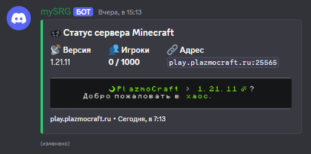

# serverpulse — Discord-бот статуса Minecraft-сервера

Discord-бот, который автоматически выводит в указанный канал статус Minecraft-сервера:

- **MOTD в виде картинки** — отрисовывается так же, как в списке серверов игры: реальный пиксельный шрифт Minecraft, цвета `§#RRGGBB`, иконка сервера;
- **Версия сервера** (берётся из MOTD);
- **Онлайн игроков в реальном времени** — прямой ping по протоколу Minecraft (без кэша), с запасным вариантом через API mcsrvstat.us;
- **Обновление одного сообщения** — бот редактирует своё предыдущее сообщение вместо отправки новых, поэтому чат не засоряется (переживает перезапуски).

## Результат



## Требования

- Python 3.10+
- Зависимости из `requirements.txt`

## Установка

1. Склонируйте репозиторий:

```bash
git clone https://github.com/PlazmoCraft/serverpulse.git
cd serverpulse
```

2. Установите зависимости:

```bash
pip install -r requirements.txt
```

## Настройка

1. Создайте бота на [Discord Developer Portal](https://discord.com/developers/applications) и скопируйте токен.
2. Пригласите бота на сервер с правом **Send Messages** в нужном канале.
3. Скопируйте `config.example.py` и дайте название `config.py`.
4. Откройте `config.py` и заполните:

```python
TOKEN = "токен_бота"
GUILD_ID = 1327906226628988948          # ID сервера
CHANNEL_ID = 1372683848252526643        # ID канала для статуса
SERVER_ADDRESS = "play.plazmocraft.ru"  # адрес Minecraft-сервера
UPDATE_INTERVAL_MINUTES = 5             # интервал обновления в минутах
```

Как узнать ID канала/сервера: включите в Discord режим разработчика
(Настройки → Дополнительно → «Режим разработчика»), затем ПКМ по каналу/серверу → «Копировать ID».

## Запуск

```bash
python main.py
```

## Как это работает

| Файл | Назначение |
|---|---|
| `main.py` | Точка входа: подключение к Discord, цикл обновления, формирование embed |
| `config.py` | Настройки бота |
| `mcping.py` | Прямой ping сервера по протоколу Minecraft (handshake + status) |
| `motd_image.py` | Разбор MOTD с цветами/стилями и отрисовка в виде изображения |
| `assets/fonts/` | Шрифты игры (атласы `ascii.png`, `nonlatin_european.png`, `accented.png` и описание `default.json`), извлечены из официального клиента Minecraft |

Цикл работы:

1. Бот пингует сервер напрямую и получает актуальный JSON (версия, игроки, MOTD, иконку).
2. MOTD рендерится в PNG с пиксельным шрифтом игры и иконкой сервера — как в списке серверов.
3. Embed с полями (Версия, Игроки, Адрес) и картинкой отправляется в канал.
4. При следующем обновлении бот **редактирует** это же сообщение. ID сообщения хранится в `status_message.json`, поэтому после перезапуска бот продолжает обновлять его, а не плодить новые.

При сбое прямого пинга бот автоматически запрашивает статус через [mcsrvstat.us](https://mcsrvstat.us/).

## Структура embed

```
🎮 Статус сервера Minecraft
┌─────────────────────────────┐
│ [иконка]  ☽ PlazmoCraft › 1.21.11 ☄  │  ← MOTD картинкой
│           Природа не прощает слабых. │
└─────────────────────────────┘
:satellite: Версия  |  :busts_in_silhouette: Игроки  |  :link: Адрес
```
